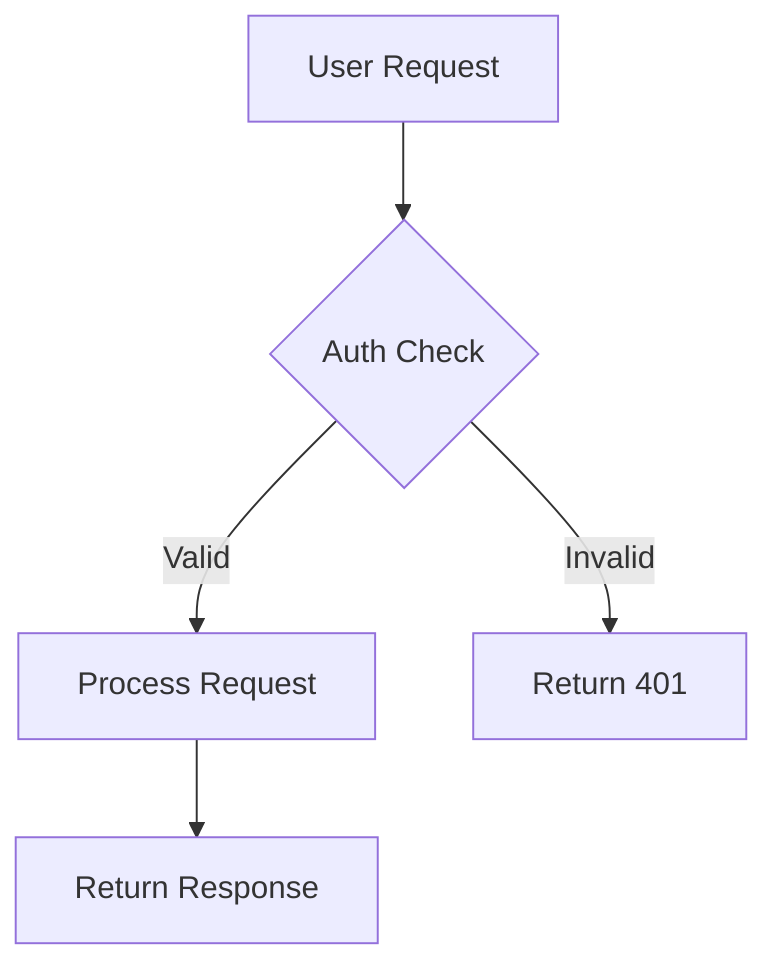

# Technical Writing Skill

Create clear, comprehensive, and maintainable technical documentation.

## When to Use
- Writing or updating README files
- Creating API documentation
- Documenting architecture decisions (ADRs)
- Writing runbooks and operational guides
- Setting up docs-as-code workflows
- Creating tutorials or how-to guides

## README Structure

A good README follows this structure:

```markdown
# Project Name

Short one-liner describing the project.

## Features
- Feature 1: Brief description
- Feature 2: Brief description

## Prerequisites
- Tool 1 (version X.Y+)
- Tool 2 (version X.Y+)

## Quick Start
\```bash
# Step 1: Clone
git clone ...

# Step 2: Install
npm install / pip install -r requirements.txt

# Step 3: Run
npm start / python main.py
\```

## Configuration
Describe environment variables, config files, etc.

## Usage
Examples of how to use the project.

## Development
How to set up dev environment, run tests, lint, etc.

## Contributing
Guidelines for contributors.

## License
```

## Documentation Types

### README.md
- **Purpose**: First impression, quick start guide
- **Audience**: New users, contributors
- **Keep it**: Concise, scannable, up-to-date

### API Documentation
- **Purpose**: How to use your API
- **Tools**: OpenAPI/Swagger, GraphQL Playground, Postman
- **Include**: Endpoint descriptions, request/response examples, error codes

### Architecture Documentation
- **Purpose**: How the system works
- **Include**: Diagrams (use Mermaid or PlantUML), component descriptions, data flow
- **Tools**: MkDocs, Docusaurus, Notion, Confluence

### Runbooks
- **Purpose**: Operational procedures for on-call engineers
- **Include**: Common issues and fixes, deployment steps, rollback procedures
- **Format**: Step-by-step with commands

### ADRs (Architecture Decision Records)
```markdown
# ADR-001: Use PostgreSQL for Primary Database

## Status
Accepted

## Context
We need a relational database that supports ACID transactions, complex queries,
and has strong ecosystem support.

## Decision
We will use PostgreSQL 16 as our primary database.

## Consequences
**Positive:**
- ACID compliance for financial data
- Rich ecosystem (extensions, tooling)
- Strong JSON support for flexible schemas

**Negative:**
- Requires connection pooling setup
- More operational complexity than SQLite
```

## Docs-as-Code Best Practices

### Directory Structure
```
docs/
├── README.md              # Documentation home
├── getting-started/       # Onboarding guides
│   ├── installation.md
│   └── quickstart.md
├── architecture/          # System design docs
│   ├── overview.md
│   └── adr/              # Architecture Decision Records
│       ├── 001-use-postgres.md
│       └── 002-rest-api.md
├── api/                   # API documentation
│   └── reference.md
├── guides/                # How-to guides
│   ├── deployment.md
│   └── troubleshooting.md
└── runbooks/              # Operational procedures
    └── incident-response.md
```

### MkDocs Configuration
```yaml
site_name: My Project Docs
theme:
  name: material
nav:
  - Home: index.md
  - Getting Started:
    - Installation: getting-started/installation.md
    - Quickstart: getting-started/quickstart.md
  - API Reference: api/reference.md
  - Architecture: architecture/overview.md
```

## Writing Guidelines

### General Principles
1. **Use active voice**: "Run the script" not "The script should be run"
2. **Be concise**: Remove filler words (very, really, just)
3. **Use present tense**: "The function returns" not "The function will return"
4. **Code examples**: Always show, don't just tell
5. **Link generously**: Link to related docs, external resources

### Formatting
- Use `code` for inline code, file names, commands
- Use ```bash for command blocks, ```python for code
- Use **bold** for emphasis, not italics
- Use tables for structured data
- Use bullet points for lists (not paragraphs)

### Diagrams
Use Mermaid for inline diagrams in Markdown:



## Checklist for New Documentation

- [ ] Clear title and purpose
- [ ] Prerequisites listed (if applicable)
- [ ] Code examples tested and working
- [ ] Links verified (no 404s)
- [ ] Images/diagrams have alt text
- [ ] Spell-checked and grammar-checked
- [ ] Technical accuracy verified

## Verification

After writing documentation:
1. Run a spell checker: `aspell check README.md`
2. Validate links: `markdown-link-check README.md`
3. Test all code examples manually
4. Have someone unfamiliar with the project read it
5. Check rendering in the actual docs platform (GitHub, MkDocs, etc.)
